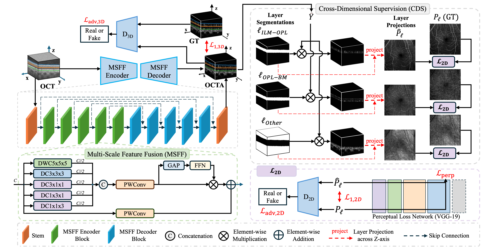

# XOCT: Enhancing OCT to OCTA Translation via Cross-Dimensional Multi-Scale Feature Learning

[](https://papers.miccai.org/miccai-2025/paper/4977_paper.pdf)
[](https://arxiv.org/abs/2509.07455)
[](https://link.springer.com/chapter/10.1007/978-3-032-04965-0_65)


<p align="center">
  
</p>

## Overview
**XOCT** is a deep learning framework for **OCT → OCTA translation** that integrates **Cross-Dimensional Supervision (CDS)** and a **Multi-Scale Feature Fusion (MSFF)** architecture to improve retinal vascular reconstruction.  
It introduces **layer-aware guidance** and **multi-scale contextual fusion**, enabling sharper vessel delineation and better preservation of fine microvascular structures across heterogeneous retinal layers.

**Key Highlights**
- **Cross-Dimensional Supervision (CDS)** — leverages segmentation-weighted en-face projections to enforce layer-specific learning and structural coherence.  
- **Multi-Scale Feature Fusion (MSFF)** — captures vessel details across scales using isotropic, anisotropic, and large-kernel convolutions with adaptive channel reweighting.  
- Demonstrated **state-of-the-art performance** on the [OCTA-500 dataset](https://ieee-dataport.org/open-access/octa-500), outperforming 2D, projection-based, and volumetric baselines.  

<p align="center">
  
</p>

## 📘 Reference
**Paper:**  
Khosravi P., Han K., Wu A.T., Rezvani A., Feng Z., Xie X.  
*XOCT: Enhancing OCT to OCTA Translation via Cross-Dimensional Supervised Multi-Scale Feature Learning.*  
In *MICCAI 2025*, pp. 695–705. Springer.  
[[PDF]](https://papers.miccai.org/miccai-2025/paper/4977_paper.pdf) | [[arXiv]](https://arxiv.org/abs/2509.07455) | [📄 Springer Proceedings](https://link.springer.com/chapter/10.1007/978-3-032-04965-0_65)

---

## 🧠 Repository Structure
```

├── data/                # Data preparation scripts
├── models/              # Model architectures (3D UNet, CDS, MSFF)
├── options/             # Training and evaluation configurations
├── scripts_3M/          # Training/evaluation scripts for OCTA-3M
│   └── xoct/
│       ├── train.sh
│       ├── test.sh
│       └── eval.sh
├── scripts_6M/          # Scripts for OCTA-6M dataset
├── unet/                # Base 2D/3D UNet modules
├── util/                # Utility functions (data loaders, metrics, plotting)
├── create_2d_projection.py
├── eval2d.py / eval3d.py
├── train2d.py / train3d.py
├── test2d_3M.py / test2d_6M.py / test3d_3M.py / test3d_6M.py
└── README.md

````

---

## ⚙️ Environment Setup
Create and activate the environment:
```bash
conda create -n xoct python=3.11
conda activate xoct
pip install -r requirements.txt
````

---

## 🚀 Training & Evaluation

### 1. Training

To train XOCT on the OCTA-3M subset:

```bash
bash scripts_3M/xoct/train.sh
```

For the OCTA-6M subset:

```bash
bash scripts_6M/xoct/train.sh
```

### 2. Testing and Evaluation

```bash
bash scripts_3M/xoct/test.sh
bash scripts_3M/xoct/eval.sh
```

---

## 📊 Dataset

The model is trained and evaluated on the **[OCTA-500 dataset](https://ieee-dataport.org/open-access/octa-500)**, which includes paired OCT/OCTA volumes and retinal layer segmentation annotations (3 mm × 3 mm and 6 mm × 6 mm subsets).

---

## 🙏 Acknowledgments

This implementation builds upon and extends prior work:

* [TransPro (Li et al., 2024)](https://github.com/ustlsh/TransPro)
* [Pix2Pix (Isola et al., CVPR 2017)](https://github.com/junyanz/pytorch-CycleGAN-and-pix2pix)

If you find this work useful, please consider citing:

```bibtex
@inproceedings{khosravi2025xoct,
  title={XOCT: Enhancing OCT to OCTA Translation via Cross-Dimensional Supervised Multi-scale Feature Learning},
  author={Khosravi, Pooya and Han, Kun and Wu, Anthony T and Rezvani, Arghavan and Feng, Zexin and Xie, Xiaohui},
  booktitle={International Conference on Medical Image Computing and Computer-Assisted Intervention},
  pages={695--705},
  year={2025},
  organization={Springer}
}
```